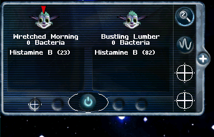

# Creatures CAOS Collection

A collection of agents for [Creatures 3](https://creatures.wiki/Creatures_3)/[Docking Station](https://creatures.wiki/Docking_Station).

## Building

You can use [Jagent](https://creatures.wiki/Jagent), [Pray Builder](https://creatures.wiki/Pray_Builder) or whatever your preferred tool is to compile the `.ps` pray source into an agent. If no `.ps` file is included, the project might use Jagents [CAOS2PRAY](https://creatures.wiki/CAOS2PRAY) feature, use the `.cos` file in Jagent to compile the agent. If both versions don't work, pray source is not set up yet, use manual installation for the files.

If you're new to agent making, take a look at the [Awesome Creatures development resources](https://github.com/Creatures-Developer-Network/awesome-creatures-development-resources).

### Files

| Extension    | Content                                                  | Creatures directory |
| ------------ | -------------------------------------------------------- | ------------------- |
| `.cos`       | [CAOS](https://creatures.wiki/CAOS) code in plain text   | Bootstrap/.../      |
| `.c16`       | Sprites/Images                                           | Images/             |
| `.catalogue` | Help texts, tooltips and some settings in plain text     | Catalogue/          |
| `.wav`       | Sound                                                    | Sounds/             |
| `.mng`       | Music                                                    | Sounds/             |
| `.ps`        | [PRAY](https://creatures.wiki/PRAY) source in plain text |                     |
| `.agents`    | Compiled pray containing script, sprites and sounds      | My Agents/          |

# Creature Care Cabinet (WIP)

*Thank you, Aiko, for the wonderful name.*

CCC is a GUI element on the left side of the screen for medical purposes.  
It is intended as an upgrade to the [Medical Monitor](https://creatures.wiki/Medical_Monitor) by Emmental and [X-Ray](https://creatures.wiki/X-Ray) by Gauhelldragon.

Creatures are scanned by species for bacterial infections and toxins. If the agent finds a sick creature, it will add it to the panel and play an alarm sound. You can target the creature by clicking on its head in the list. Number of bacteria and level of found toxins are listed below.

The chemical graph module has several presets, each drawing a graph for eight different chemicals for the currently targeted creature. Presets can be customized in the catalogue file.

## planned

* **Life events**  
    Notification for sick creatures, similar to birth and death events
* **Organs module**  
    Show organ health for targeted creature
* **Inject module**  
    Inject cures and treat infections
